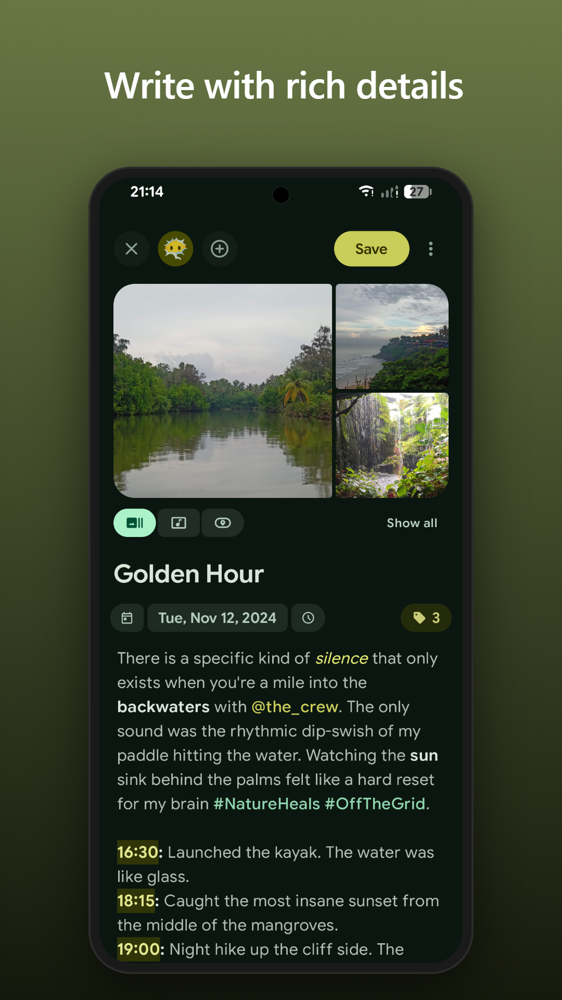
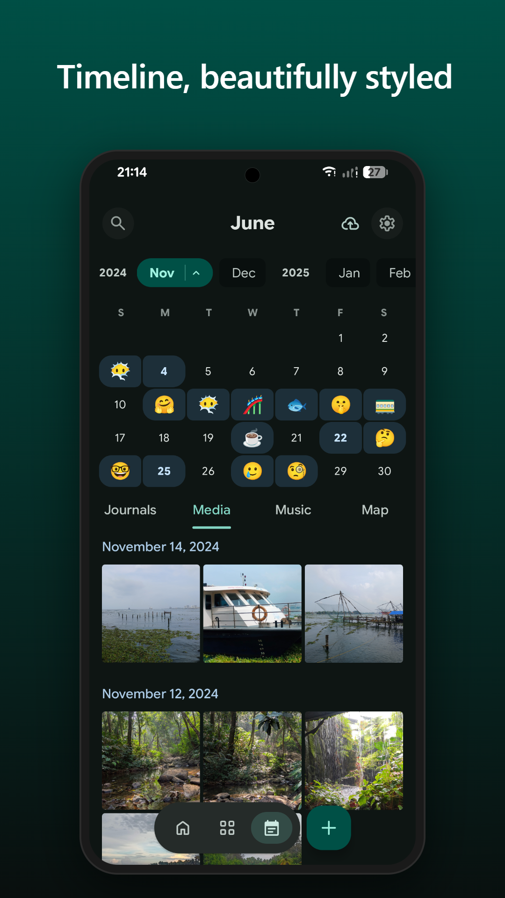
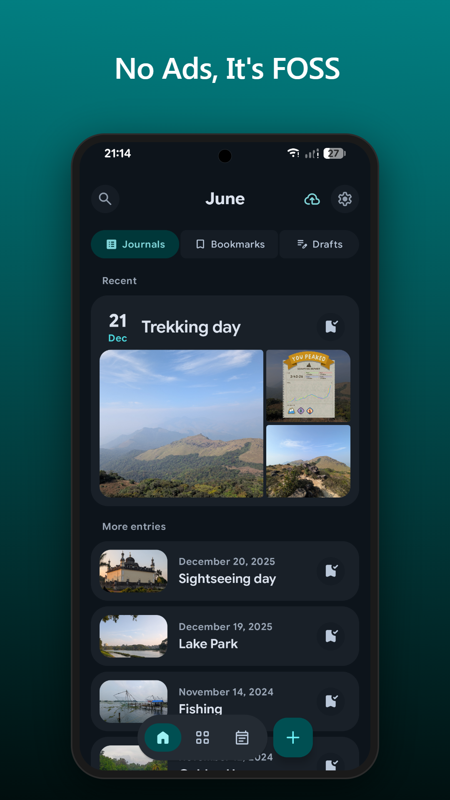
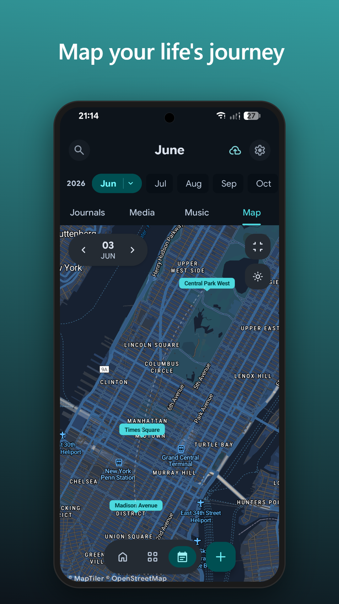
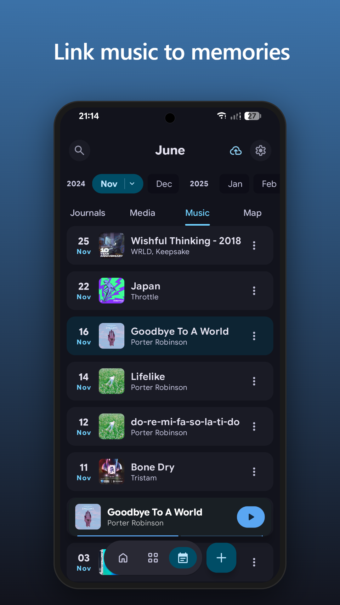
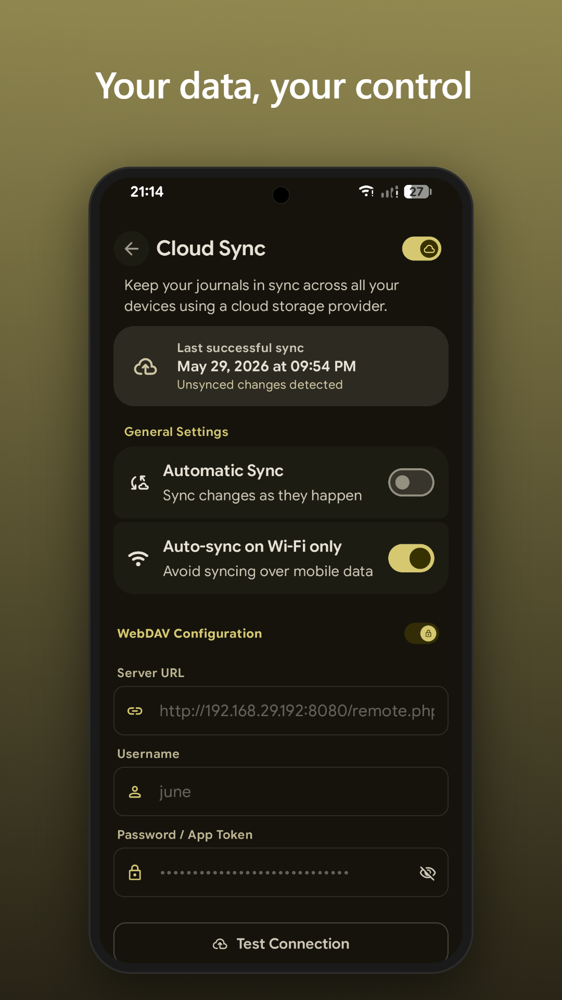

# 呢喃 · June

<p align="center">
  
</p>

<p align="center">
  <strong>一款开源的私人日记应用</strong><br>
  Built with Jetpack Compose & Material Design 3
</p>

<p align="center">
    <a href="https://github.com/Graffiti-yH/ninan/releases/latest">
        
    </a>
    <a href="https://github.com/Graffiti-yH/ninan/releases">
        
    </a>
    <a href="https://github.com/Graffiti-yH/ninan/releases">
        
    </a>
</p>

<p align="center">
  
  
  
  
  
  
</p>

## ✨ 核心功能

呢喃是一款功能丰富的多媒体日记应用，让你的每一篇日记都成为生活的时光胶囊。

### 📝 AI 心理分析（全新）
- **AI 心理状态分析** — 基于 **CBT（认知行为疗法）** 框架，AI 自动分析日记中的情绪模式和认知偏差
- **情绪追踪** — 识别灾难化思维、非黑即白等认知偏差，提供建设性改进建议
- **趋势分析** — 追踪情绪变化趋势（改善中 / 稳定 / 下降）
- **自定义 AI 服务** — 支持接入 Deepseek、OpenAI 等兼容 API，用户自行管理 API Key，数据自主可控
- **本地模型支持** — 可使用 Ollama 等本地模型，确保日记数据不出设备

### 📸 记录每个细节
- **多媒体日记** — 支持添加 **照片、视频** 和 **精确定位**
- **智能标签** — 三种标签分组：**空间**、**人物**、**主题**
- **音乐集成** — 粘贴流媒体链接（Spotify、Apple Music 等），自动获取封面和歌曲信息
- **表情心情** — 用 emoji 标记每日心情，追踪情绪轨迹
- **富文本编辑** — 支持加粗、斜体、下划线、高亮和 **标签自动补全**

### 📅 回顾与发现
- **时间线视图** — 月历导航 + 媒体/音乐/地图聚合浏览
- **连续记录** — 日历 streaks 和写作热力图，培养日记习惯
- **日记提醒** — 灵活的定时提醒，保持记录节奏
- **智能搜索** — 全文搜索 + 多标签组合筛选（如 `@小明` + `#旅行`）

### 🔒 安全与隐私
- **隐私保险箱** — 生物识别锁 / 自定义 PIN，支持截屏防护
- **动态主题** — Material You 取色 + 自定义字体选择
- **完全离线** — 支持本地备份与恢复，数据由你掌控
- **网络开关** — 可完全关闭外部网络访问
- **云同步** — 通过 **WebDAV** 跨设备同步（支持 Nextcloud、ownCloud 等）
- **Google Drive 同步** — Play 版本支持 Google Drive 同步

---

## 🛠 技术栈

### 架构与核心
- **语言：** [Kotlin](https://kotlinlang.org/)（100%）
- **UI：** [Jetpack Compose](https://developer.android.com/jetpack/compose)（Material 3）
- **架构：** MVVM + Clean Architecture
- **依赖注入：** [Koin](https://insert-koin.io/)
- **导航：** [Jetpack Navigation Compose](https://developer.android.com/guide/navigation/navigation-compose)
- **异步：** Coroutines & Flow

### 数据与网络
- **本地数据库：** [Room](https://developer.android.com/training/data-storage/room)
- **偏好存储：** [DataStore](https://developer.android.com/topic/libraries/architecture/datastore)
- **网络：** [OkHttp](https://square.github.io/okhttp/) & [Retrofit](https://square.github.io/retrofit/)

### UI 与媒体
- **图片加载：** [Coil](https://coil-kt.github.io/coil/)
- **音视频：** [Media3 ExoPlayer](https://developer.android.com/media/media3)
- **地图：** [MapLibre](https://maplibre.org/)（支持 Carto、MapTiler、Mapbox、Stadia、OSM）
- **主题：** [MaterialKolor](https://github.com/jordond/MaterialKolor)

---

## 📦 下载与构建

### 下载 APK
从 [Releases 页面](https://github.com/Graffiti-yH/ninan/releases) 下载最新 APK。

### 本地构建
```bash
# 克隆仓库
git clone https://github.com/Graffiti-yH/ninan.git

# 使用 Android Studio（JDK 17）打开项目
# 选择 fossDebug 变体，运行到设备

# 或命令行构建
./gradlew assembleFossDebug
```

### 构建产物
```
app/build/outputs/apk/foss/debug/
├── june-*-arm64-v8a.apk      # 大多数现代手机
├── june-*-armeabi-v7a.apk    # 旧设备
└── june-*-universal.apk      # 全兼容（体积较大）
```

---

## 🔐 安全验证

### 签名证书指纹（GitHub Release）
```
E8:21:01:FC:C2:20:98:61:AF:DF:81:1C:03:12:F6:2A:A5:BA:8B:E3:10:E1:D2:74:C6:91:CE:6E:B5:D1:B7:BB
```

### 验证 Release APK
```bash
gh attestation verify june-*.apk --repo Graffiti-yH/ninan
```

---

## 📄 许可

本项目基于 **GPL-3.0** 许可证开源。

[隐私政策](https://densermeerkat.github.io/June/PRIVACY)
